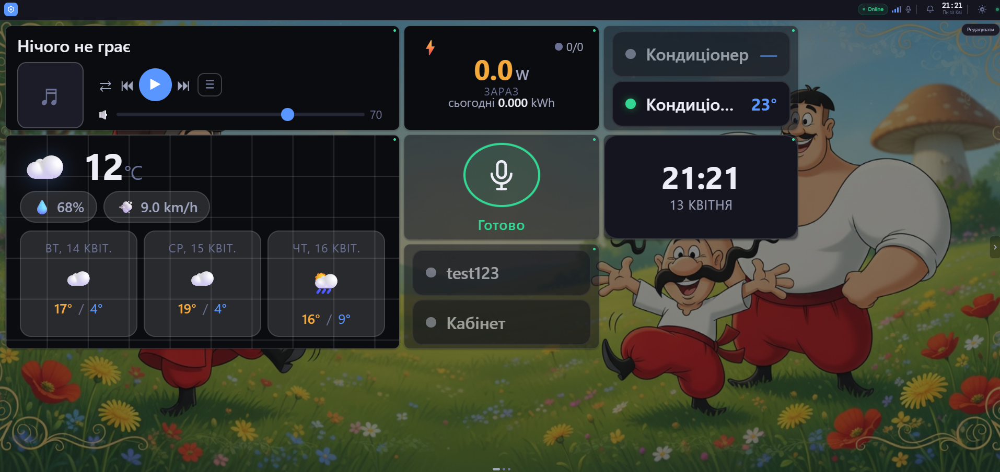
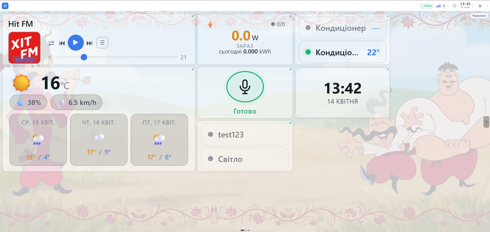

<div align="center">

<!-- TODO: add logo to docs/assets/logo.png -->

# SelenaCore

**Локальний хаб для розумного будинку. Без хмари. Без підписки. Тільки ваше залізо.**

[](../../LICENSE)
[](https://python.org)
[](https://fastapi.tiangolo.com)
[](https://docker.com)
[](https://github.com/dotradepro/SelenaCore/stargazers)
[](https://github.com/dotradepro/SelenaCore/issues)

[🇬🇧 English](../../README.md) · [📖 Документація](https://docs.selenehome.tech) · [🐛 Повідомити про баг](https://github.com/dotradepro/SelenaCore/issues) · [💡 Обговорення](https://github.com/dotradepro/SelenaCore/discussions)

</div>

---

<p align="center">
  
  &nbsp;
  
</p>
<p align="center"><sub>Дашборд на 7" kiosk-екрані — темна вечірня / світла денна теми, медіа, погода, клімат, голосове керування.</sub></p>

---

## 📺 Відеоогляд

<p align="center">
  <a href="https://www.youtube.com/watch?v=wgLH4JTtVDo">
    
  </a>
</p>
<p align="center"><sub>▶ <a href="https://www.youtube.com/watch?v=wgLH4JTtVDo">Дивитися на YouTube</a> — 5-хвилинний огляд: встановлення, голосовий стек, переклад, дашборд.</sub></p>

---

## Чому SelenaCore?

- **100% офлайн** — голосовий асистент, автоматизації, керування пристроями працюють на вашому залізі. Інтернет — опціонально.
- **Без підписки** — налаштував один раз, безкоштовно назавжди. Без акаунтів і тарифів.
- **Ваші дані лишаються вдома** — нічого не виходить за межі локальної мережі, якщо ви явно не ввімкнете хмарну синхронізацію.
- **Працює на Raspberry Pi 4** — без серверів, без шафи, без вентиляторів.

---

## Можливості

### 🎙️ Офлайн-голосовий асистент

Повний офлайн pipeline STT (Vosk / Whisper) і TTS (Piper). Локальний LLM через Ollama для розуміння природної мови. Хмарні LLM (OpenAI, Anthropic, Groq) — опціональний резерв. Моделі вибираються та завантажуються з браузерного майстра первинного налаштування.

### 🧩 Модульна архітектура

24 вбудовані системні модулі (голос, керування пристроями, клімат, освітлення, енергія, автоматизації, медіа й інші) працюють in-process без накладних витрат. Користувацькі модулі запускаються в ізольованих Docker-контейнерах і спілкуються виключно через шину модулів (Module Bus) WebSocket. Модулі не можуть імпортувати один одного.

### 🔌 Система провайдерів у рантаймі

`device-control` — це система провайдерів з підтримкою plug-in. Вбудовані провайдери: Tuya LAN, Tuya Cloud, Gree / Pular Wi-Fi кондиціонери, MQTT. Додаткові (Philips Hue Bridge, ESPHome тощо) встановлюються одним кліком з UI — без перезбирання, без перезапуску контейнера.

### 🏠 Авто-маршрутизація та розумний імпорт

Коли ви імпортуєте пристрій — вручну, з Tuya чи через Gree-сканер — він автоматично маршрутизується у потрібний модуль (`climate` / `lights-switches`) за `entity_type` і реєструється як джерело в енергомоніторі. Жодного ручного налаштування.

### 🛡️ Агент цілісності (Integrity Agent)

Окремий процес кожні 30 секунд верифікує SHA256 кожного файлу ядра. У разі змін: зупиняє всі модулі → повідомляє → відкатує → переходить у БЕЗПЕЧНИЙ РЕЖИМ (SAFE MODE). Ядро неможливо тихо модифікувати.

### 📱 Налаштування за 10 хвилин

Один скрипт `install.sh`, далі 9-кроковий браузерний майстер: Wi-Fi, моделі STT/TTS, LLM, користувач-адмін. Без SSH, без редагування конфігів. Працює навіть з телефона.

### ⚡ Енергомоніторинг

Авто-відстеження споживання для кожного зареєстрованого пристрою. Єдина фільтрована таблиця з пошуком, фільтрами по кімнатах і типах. Клік по плитці на дашборді відкриває повноекранну детальну таблицю.

### 🔄 OTA-оновлення

Вбудований `update-manager` щоденно о 03:00 перевіряє GitHub Releases, завантажує з SHA256-верифікацією, робить бекап і атомарно застосовує оновлення через systemd. Один клік для оновлення.

---

## Швидкий старт

### Залізо

| Платформа                          | RAM   | Примітки                                     |
|------------------------------------|-------|----------------------------------------------|
| Raspberry Pi 4 / 5                 | 4 ГБ+ | Рекомендовано для більшості сценаріїв        |
| NVIDIA Jetson Orin Nano            | 8 ГБ  | STT / TTS з GPU-прискоренням                 |
| Будь-який Linux SBC (ARM64/x86_64) | 2 ГБ+ | Базова функціональність, без локального LLM  |

ОС: Ubuntu 22.04+ або Raspberry Pi OS Bookworm. Docker 24+ і Docker Compose v2 встановлюються автоматично.

### Встановлення одним скриптом (рекомендовано)

```bash
git clone https://github.com/dotradepro/SelenaCore.git
cd SelenaCore
sudo ./install.sh
```

`install.sh` встановлює Docker, створює системного користувача `selena` і директорії, збирає контейнери і виводить URL виду `http://<lan-ip>/`. Все інше — завантаження моделей, вибір голосу, LLM, акаунт-адмін, нативні systemd-сервіси — відбувається у браузерному **first-run wizard** з живим прогрес-баром.

### Ручне встановлення

```bash
git clone https://github.com/dotradepro/SelenaCore.git
cd SelenaCore
cp .env.example .env
cp config/core.yaml.example config/core.yaml
docker compose up -d --build
```

### Адреси

- `http://localhost` або `http://smarthome.local` — Web UI + API
- `https://localhost` — HTTPS через self-signed TLS-проксі (~5 МБ накладних витрат)
- `http://localhost/docs` — Swagger UI (тільки коли `DEBUG=true`)

---

## Архітектура

```
+--------------------------------------------------------------+
|                  SelenaCore (FastAPI :80)                    |
|                                                              |
|  +--------------------------------------------------------+  |
|  |          24 системні модулі (in-process)               |  |
|  |  voice_core · llm_engine · climate · lights_switches   |  |
|  |  device_control (система провайдерів) · energy_monitor |  |
|  |  automation_engine · update_manager · scheduler        |  |
|  |  user_manager · secrets_vault · hw_monitor · ...       |  |
|  +-----------------------+--------------------------------+  |
|                          | EventBus (asyncio.Queue)          |
|  +-----------------------+--------------------------------+  |
|  |  Шина модулів (WebSocket ws://host/api/v1/bus)         |  |---> Користувацькі модулі
|  +--------------------------------------------------------+  |     (Docker)
|                                                              |
|  Реєстр пристроїв (SQLite) · Cloud Sync (HMAC-SHA256)        |
|  Secrets Vault (AES-256-GCM) · SyncManager · i18n (en, uk)   |
+--------------------------------------------------------------+

HTTPS :443 ---> TLS-проксі (asyncio, ~5 МБ RAM) ---> :80

+--------------------------------------+
|  Агент цілісності (окремий процес)   |
|  SHA256 кожні 30с                    |
|  Відкат + БЕЗПЕЧНИЙ РЕЖИМ            |
+--------------------------------------+
```

Загальне споживання пам'яті: **~1.5 ГБ RAM** для всього стека на Pi 4. Повний дизайн див. [docs/architecture.md](../architecture.md).

---

## Модулі

| Модуль               | Призначення                                                                       |
|----------------------|------------------------------------------------------------------------------------|
| `voice_core`         | STT (Vosk / Whisper), TTS (Piper), wake-word, ідентифікація мовця, режим приватності |
| `llm_engine`         | Локальний LLM (Ollama), Fast Matcher, 6-рівневий маршрутизатор інтентів            |
| `ui_core`            | React SPA + PWA (видається безпосередньо ядром)                                    |
| `device_control`    | Реєстр пристроїв, система провайдерів (Tuya / Gree / Hue / ESPHome / MQTT)         |
| `climate`            | Керування кондиціонерами і термостатами по кімнатах                                |
| `lights_switches`    | Освітлення, вимикачі, розетки — on/off, яскравість, RGB                            |
| `energy_monitor`     | Облік споживання, статистика кВт·год, авто-маршрутизація                           |
| `automation_engine`  | YAML-правила: тригери (час / подія / пристрій / присутність) → дії                 |
| `update_manager`     | OTA-оновлення з GitHub Releases з SHA256-верифікацією                              |
| `scheduler`          | Cron / інтервал / схід-захід сонця                                                 |
| `user_manager`       | Профілі, PIN, Face ID, журнал аудиту                                               |
| `secrets_vault`      | AES-256-GCM сховище токенів                                                        |
| `hw_monitor`         | Температура CPU, RAM, диск, uptime — опитування 30с                                |
| `media_player`       | Інтернет-радіо, USB, SMB, Internet Archive — голос, обкладинки                     |
| `protocol_bridge`    | Шлюз MQTT / Zigbee / Z-Wave / HTTP до реєстру пристроїв                            |
| `weather_service`    | Локальна погода і прогноз через Open-Meteo (без API-ключа)                         |
| `presence_detection` | Детекція присутності через ARP, Bluetooth, Wi-Fi MAC                               |
| `device_watchdog`    | Моніторинг доступності пристроїв                                                   |
| `notification_router`| Маршрутизація сповіщень: TTS, Telegram, Web Push, webhooks                         |
| `notify_push`        | Web Push (VAPID)                                                                   |
| `network_scanner`    | ARP / mDNS / SSDP / Zigbee discovery                                               |
| `clock`              | Будильники, таймери, нагадування, світовий годинник, секундомір                    |
| `backup_manager`     | Локальний USB / SD і E2E хмарний бекап                                             |
| `remote_access`      | Віддалений доступ через Tailscale                                                  |

Повний довідник: [docs/modules.md](../modules.md).

---

## Система провайдерів

`device-control` має систему провайдерів з підтримкою plug-in у рантаймі. Нові сімейства пристроїв додаються без перезбирання контейнера.

| Провайдер     | Протокол            | Вбудований | Примітки                                |
|---------------|---------------------|------------|------------------------------------------|
| `tuya_local`  | Tuya LAN (tinytuya) | ✅         | Без облікового запису розробника         |
| `tuya_cloud`  | Tuya Sharing SDK    | ✅         | Без хмарного акаунта                     |
| `gree`        | Gree UDP / AES      | ✅         | Pular, Cooper&Hunter, EWT кондиціонери   |
| `mqtt`        | MQTT-міст           | ✅         | Через `protocol_bridge`                  |
| `philips_hue` | Hue Bridge LAN      | Встановити | Бібліотека `phue`                        |
| `esphome`     | Native asyncio API  | Встановити | Push-based                               |

Встановлення з UI: **Налаштування → device-control → Providers → Install**. Див. [docs/providers.md](../providers.md).

---

## Core API

| Метод  | Шлях                      | Опис                                          |
|--------|---------------------------|------------------------------------------------|
| GET    | `/api/v1/health`          | Стан ядра (без авторизації)                    |
| GET    | `/api/v1/system/info`     | Інфо про залізо і версію                       |
| GET    | `/api/v1/devices`         | Список пристроїв                               |
| POST   | `/api/v1/devices`         | Реєстрація пристрою                            |
| PATCH  | `/api/v1/devices/{id}/state` | Оновлення стану                             |
| POST   | `/api/v1/events/publish`  | Публікація події                               |
| GET    | `/api/v1/modules`         | Список модулів                                 |
| POST   | `/api/v1/modules/install` | Встановлення модуля (ZIP)                      |
| WS     | `/api/v1/bus?token=TOKEN` | Шина модулів (WebSocket)                       |
| WS     | `/api/ui/sync?v=N`        | Синхронізація стану UI (WebSocket з версіями)  |

Авторизація: `Authorization: Bearer <module_token>`. Повний довідник: [docs/api-reference.md](../api-reference.md).

---

## Створення модуля

```bash
smarthome new-module my-module
cd my-module
smarthome dev
smarthome publish . --core http://smarthome.local
```

```python
from sdk.base_module import SmartHomeModule, intent, on_event, scheduled

class MyModule(SmartHomeModule):
    name = "my-module"

    @intent(r"turn on (?P<what>.+)")
    async def handle_turn_on(self, text: str, context: dict) -> dict:
        return {"tts_text": f"Turning on {context['what']}"}

    @on_event("device.state_changed")
    async def on_device_change(self, event: dict) -> None:
        ...

    @scheduled(cron="0 7 * * *")
    async def morning_routine(self) -> None:
        ...
```

Повний посібник: [docs/module-development.md](../module-development.md).

---

## Конфігурація

| Змінна             | Значення за замовчуванням            | Опис                                  |
|--------------------|--------------------------------------|----------------------------------------|
| `CORE_PORT`        | `80`                                 | Єдиний порт API + UI                   |
| `CORE_DATA_DIR`    | `/var/lib/selena`                    | База даних, моделі, бекапи             |
| `CORE_SECURE_DIR`  | `/secure`                            | Шифровані токени, TLS-сертифікати      |
| `CORE_LOG_LEVEL`   | `INFO`                               | DEBUG / INFO / WARNING                 |
| `DEBUG`            | `false`                              | Вмикає Swagger UI на `/docs`           |
| `PLATFORM_API_URL` | `https://selenehome.tech/api/v1`     | Хмарна платформа (опціонально)         |
| `OLLAMA_URL`       | `http://localhost:11434`             | Локальний LLM endpoint                 |
| `UI_HTTPS`         | `true`                               | TLS-проксі на `:443`                   |

Повний довідник: [docs/configuration.md](../configuration.md).

---

## Структура проєкту

```
selena-core/
├── core/
│   ├── main.py              # FastAPI lifespan — єдиний процес :80
│   ├── config.py            # Pydantic settings
│   ├── module_bus.py        # WebSocket шина модулів
│   ├── api/
│   │   ├── sync_manager.py  # Синхронізація стану UI (версіонований WebSocket)
│   │   └── routes/          # REST + WebSocket + видача SPA
│   ├── registry/            # Реєстр пристроїв + DriverProvider ORM
│   ├── eventbus/            # Async event bus
│   ├── module_loader/       # Менеджер плагінів + Docker sandbox
│   └── cloud_sync/          # HMAC-підписана хмарна синхронізація
├── system_modules/          # 24 вбудовані модулі
│   ├── voice_core/
│   ├── llm_engine/
│   ├── device_control/      # providers/, drivers/ (gree, tuya_*, ...)
│   ├── climate/
│   ├── lights_switches/
│   ├── energy_monitor/
│   ├── update_manager/
│   └── …                    # ще 17
├── agent/                   # Агент цілісності (окремий процес)
├── sdk/                     # Базовий клас SmartHomeModule + CLI
├── modules/                 # Модулі, встановлені користувачем (Docker)
├── config/                  # core.yaml.example, локалі, інтенти
├── scripts/                 # start.sh, install.sh, systemd units
├── tests/                   # pytest (72+ тестів)
└── docker-compose.yml
```

---

## Roadmap

- [ ] Підтримка Matter / Thread
- [ ] UI маркетплейсу модулів
- [ ] Мобільний застосунок (React Native)
- [ ] Mesh-мережа з кількох хабів
- [ ] Інструмент повної міграції з Home Assistant
- [ ] Покращення voice print (ідентифікації мовця)

---

## Як долучитися

PR, баг-репорти, переклади, тести на залізі та ідеї модулів — все вітається. Перед PR:

```bash
pytest tests/ -x -q
python -m mypy core/ --ignore-missing
```

Повний робочий процес: [CONTRIBUTING.md](../../CONTRIBUTING.md).

---

## Безпека

Будь ласка, **не відкривайте публічний issue** для повідомлень про вразливості. Використовуйте [GitHub Security Advisories](https://github.com/dotradepro/SelenaCore/security/advisories/new). Повна політика: [SECURITY.md](../../SECURITY.md).

---

<div align="center">

## Підтримка проєкту

[](https://github.com/sponsors/dotradepro)
[](https://ko-fi.com/dotradepro)

Спонсорство покриває нове залізо для тестів (Pi 5, Jetson, Zigbee-донгли), час на розробку, відео-туторіали та інфраструктуру маркетплейсу.

---

Зроблено з ❤️ для людей, які вірять, що ваш будинок має працювати на вас — а не навпаки.

[⭐ Поставити зірку](https://github.com/dotradepro/SelenaCore/stargazers) · [🐛 Повідомити про issue](https://github.com/dotradepro/SelenaCore/issues) · [💬 Обговорення](https://github.com/dotradepro/SelenaCore/discussions)

</div>
